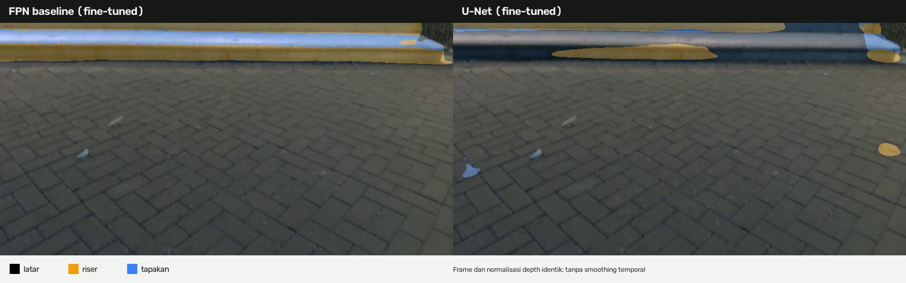
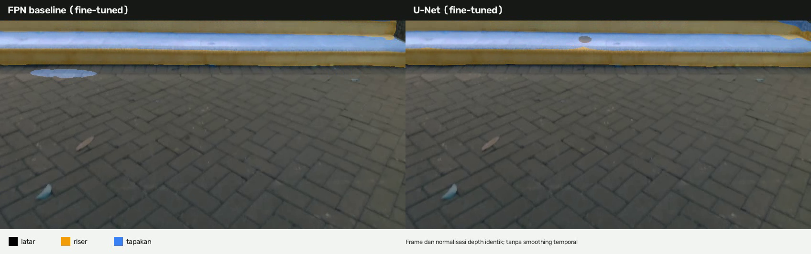
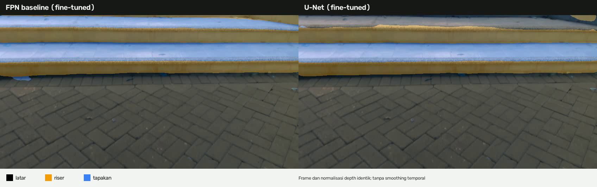
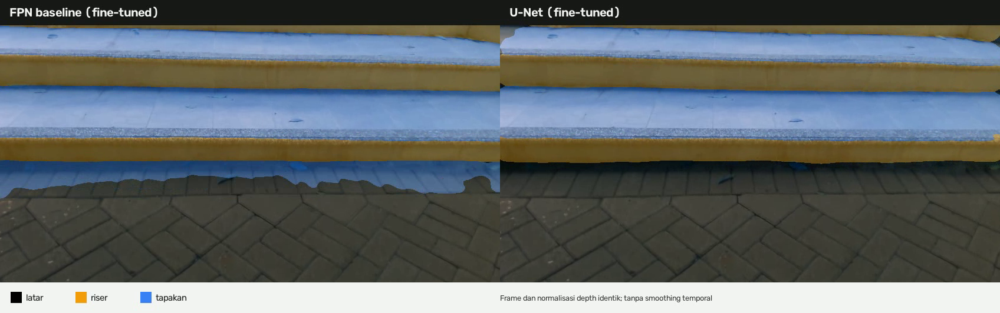
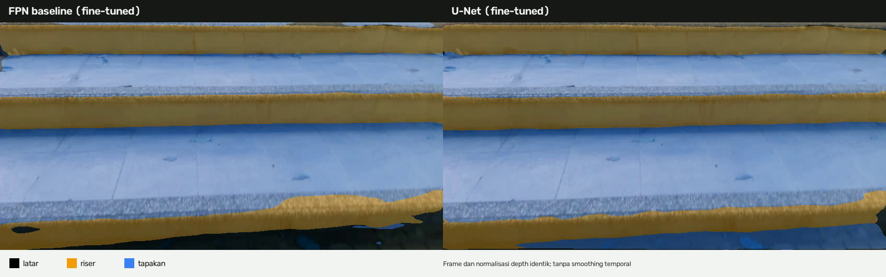
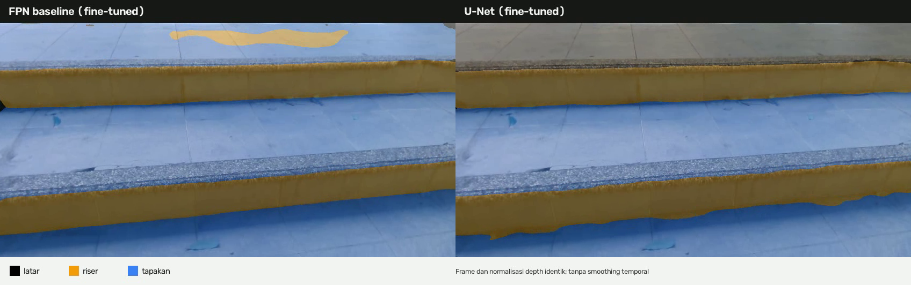

# Catatan eksperimen U-Net dibanding FPN

Pembaruan 8 September 2026. Catatan ini mendampingi checkpoint, video, dan
kode pada repositori agar hasilnya tidak dibaca melebihi bukti yang tersedia.

## Tujuan

Eksperimen menguji satu perubahan arsitektur: *decoder* FPN pada ConvNeXt V2
Atto RGB-D diganti dengan *decoder* U-Net ringan. Encoder RGB dan kedalaman,
fusi bergerbang empat skala, kepala garis, kelas keluaran, praproses, fungsi
rugi, serta konfigurasi *fine-tuning* D435 dipertahankan. Jadi eksperimen ini
bukan model baru yang menggantikan seluruh sistem, melainkan pembanding decoder.

## Data dan status perbandingan

Kedua model di-*fine-tune* pada rekaman D435 yang sama:

| Peran | Rekaman | Jumlah frame |
| --- | --- | ---: |
| Latih | 013859, 105633, 105802, 105840, 110530 | 298 |
| Validasi pemilihan checkpoint | 110152 | 26 |

Rekaman 110152 tidak masuk pelatihan. Akan tetapi, ia **dipakai untuk memilih
epoch terbaik**, sehingga ia bukan set uji akhir. Selain itu, tahap pra-latih
publik belum setara sepenuhnya: baseline FPN diinisialisasi dari checkpoint
pra-latih yang telah ada, sedangkan U-Net dimulai dari `screen_12/best.pt`
(12 epoch). Karena itu hasil berikut hanya catatan eksperimen awal, bukan
kesimpulan bahwa U-Net mengungguli FPN.

| Model | Checkpoint terbaik | Mean Dice validasi | Boundary F1 validasi |
| --- | ---: | ---: | ---: |
| FPN ConvNeXt RGB-D | epoch 22 | 0,8824 | 0,8163 |
| U-Net ConvNeXt RGB-D | epoch 15 | 0,9002 | 0,9326 |

U-Net memperoleh nilai lebih tinggi pada dua metrik tersebut di 26 frame
validasi. Namun inspeksi video memperlihatkan bahwa FPN kadang menghasilkan
bidang riser dan tapakan yang tampak lebih utuh; U-Net lebih berhati-hati pada
lantai datar, tetapi dapat memotong sebagian permukaan tangga. Kesesuaian mask
harus dibandingkan dengan anotasi, bukan dinilai dari tampilan warna saja.

## Contoh visual

Enam gambar berikut diambil berurutan pada detik 10--15 dari rekaman validasi
110152. Rekaman ini tidak masuk pelatihan, tetapi tetap bukan set uji akhir
karena dipakai memilih epoch terbaik. Setiap gambar menempatkan FPN di kiri dan
U-Net di kanan.













Gambar menggunakan frame RGB, *letterbox*, dan normalisasi kedalaman yang
sama. Tidak ada *smoothing* temporal, pelacakan, atau pemasangan bidang agar
perbedaan yang terlihat berasal dari prediksi model semata.

## Artefak dan reproduksi

- `cnx_atto_unet_d435_110152_holdout_best.pt` adalah checkpoint U-Net yang
  dipakai membuat video; bobot ini memiliki decoder `unet_light`.
- Kode model, pelatihan, *fine-tuning*, dan perender video berada di
  [`../unet-new/`](../unet-new/).
- Konfigurasi tepat perenderan tersimpan pada berkas `.mp4.json` di folder ini.
- Integritas checkpoint dan gambar dapat diperiksa dengan `sha256sum -c
  artefak_unet/SHA256SUMS`.

Jalankan ulang video validasi dari akar proyek:

```bash
python unet-new/bandingkan_video_d435.py \
  --bag dataset/studio_rgbd/rekaman/tangga_naik/TANGGA_NAIK_20260830_110152/source/raw.db3 \
  --fpn bobot/kandidat/final_d435/cnx_atto_in1k/best.pt \
  --unet artefak_unet/cnx_atto_unet_d435_110152_holdout_best.pt \
  --output output/banding_fpn_unet_110152.mp4
```

## Keputusan sementara

FPN tetap kandidat utama yang lebih aman untuk saat ini karena tampilannya lebih
konsisten pada beberapa bagian video dan latensi arsitekturnya sebelumnya lebih
rendah pada RTX 4060. U-Net tetap dipertahankan sebagai pembanding. Keputusan
akhir harus memakai pra-latih yang disetarakan, set uji yang tidak pernah dipakai
untuk pemilihan checkpoint, pengukuran positif-palsu lantai, kestabilan temporal,
serta latensi dan memori pada Jetson Orin Nano.
